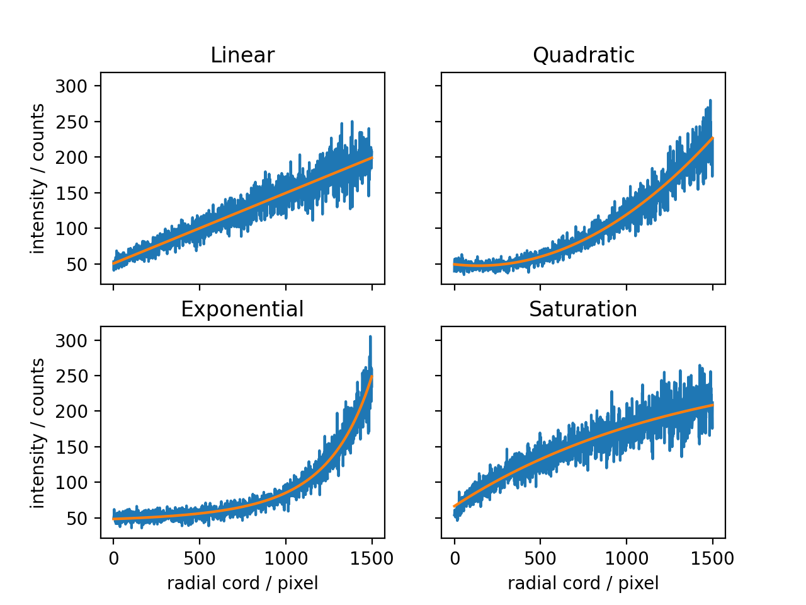

# CT edge hardening remover

This repository provides a python script to remove the edge-hardening effect on cylindrical specimens.

The example specimens are hydrated C3S/C2S cylinders. They contain some (larger) pores. These pores are masked and should not affect the resulting background correction too much.

The Jupyter notebook contains example code, which demonstrates the usage.

The expected dataset is a 3-dimensional TIF-images (8bit).

## Background Function Fit
The radial intensity distribution can be approximated by fitting different kind of functions. Currently implemented are:
- `LinearBackgroundFunction`: $b + a x$
- `QuadraticBackgroundFunction`: $c + bx + ax^2$
- `ExponentialBackgroundFunction`: $c + d^{d^{(x - x_0) / b}}$
- `SaturationBackgroundFunction`: $d - cb^{-ax + d}$
- `RootBackgroundFunction`: $b + a x^n$


New functional relationships can be easily derived from the `_BackgroundFunction` base class.

```python
class SaturationBackgroundFunction(_BackgroundFunction):
    def __init__(self):
        function = lambda x, a, b, c, d: d - c * b ** (-a * x + d)
        function_string = "d - c * b ** (-a * x + d)"
        super().__init__(
            function=function,
            function_string=function_string
            )
```

## Circularity Correction
